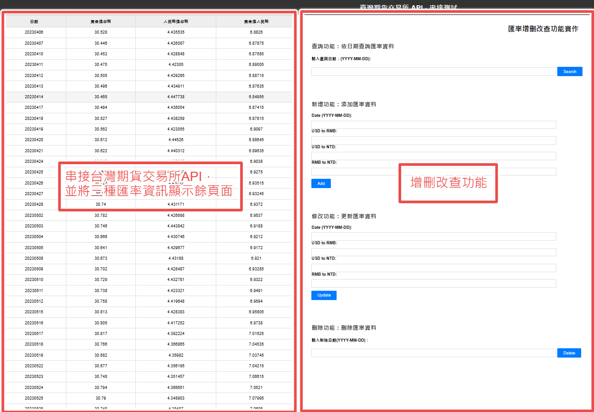
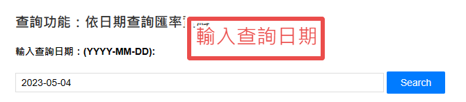
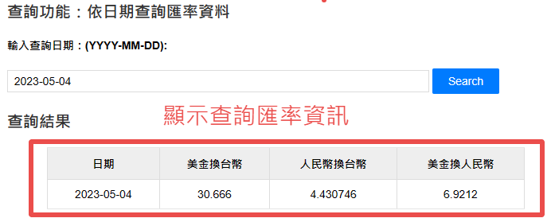
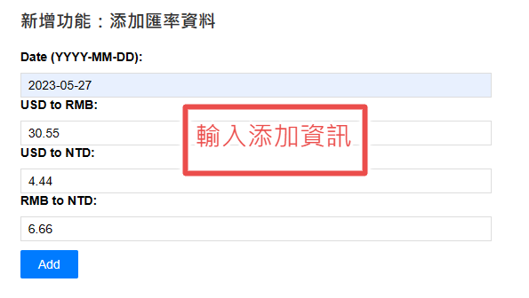
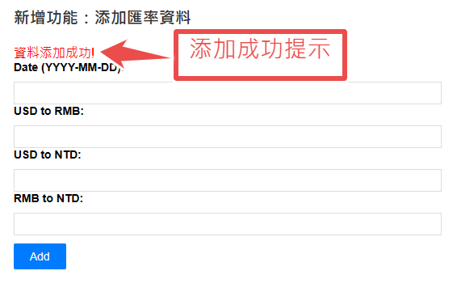
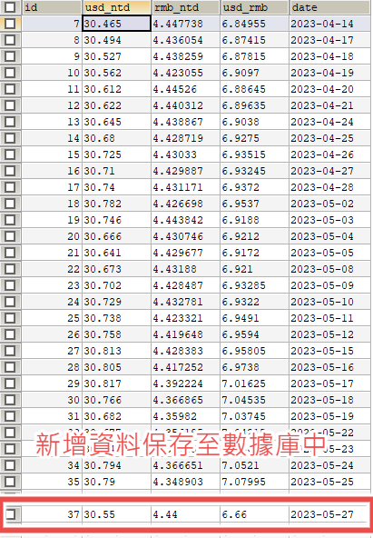
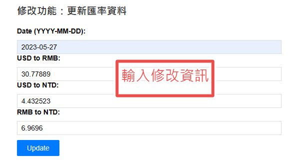
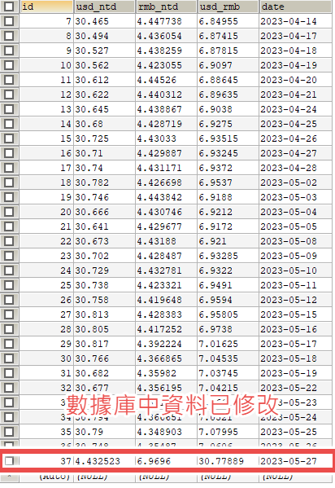
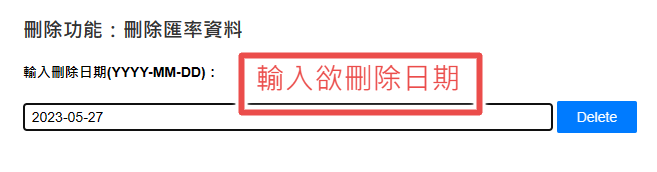
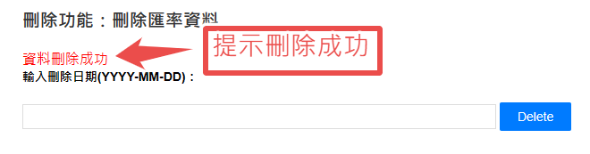

# OpenApiTest

臺灣期貨交易所API串接測試、實作增刪改查功能

## 使用技術

- 前端
  - html
  - css
  - javascript
  - ajax
- 後端
  - SpringBoot Data Jpa
  - Thymeleaf
- 資料庫
  - MySql
- 其他
  - Git、Github
  - Maven
  - MVC設計模式
  - RESTful API
  - Tomcat

## 演示(Demo)

### 頁面

- 頁面左側顯示美金換台幣、人民幣換台幣、美金換人民幣三種匯率資訊，頁面右側展示增刪改查功能

### 增刪改查功能介紹

##### 查詢匯率資訊

* 輸入查詢日期，可查詢該日期的匯率資料

##### 新增匯率資訊

* 輸入日期及匯率，將資料添加到MySql數據庫

##### 修改匯率資訊

* 輸入日期及匯率，修改資料庫中的數據

##### 刪除匯率資訊

* 輸入日期，刪除資料庫中的數據

V1.0--2023/05/29

--臺灣期貨交易所API串接測試完成

--實作增刪改查功能完成

